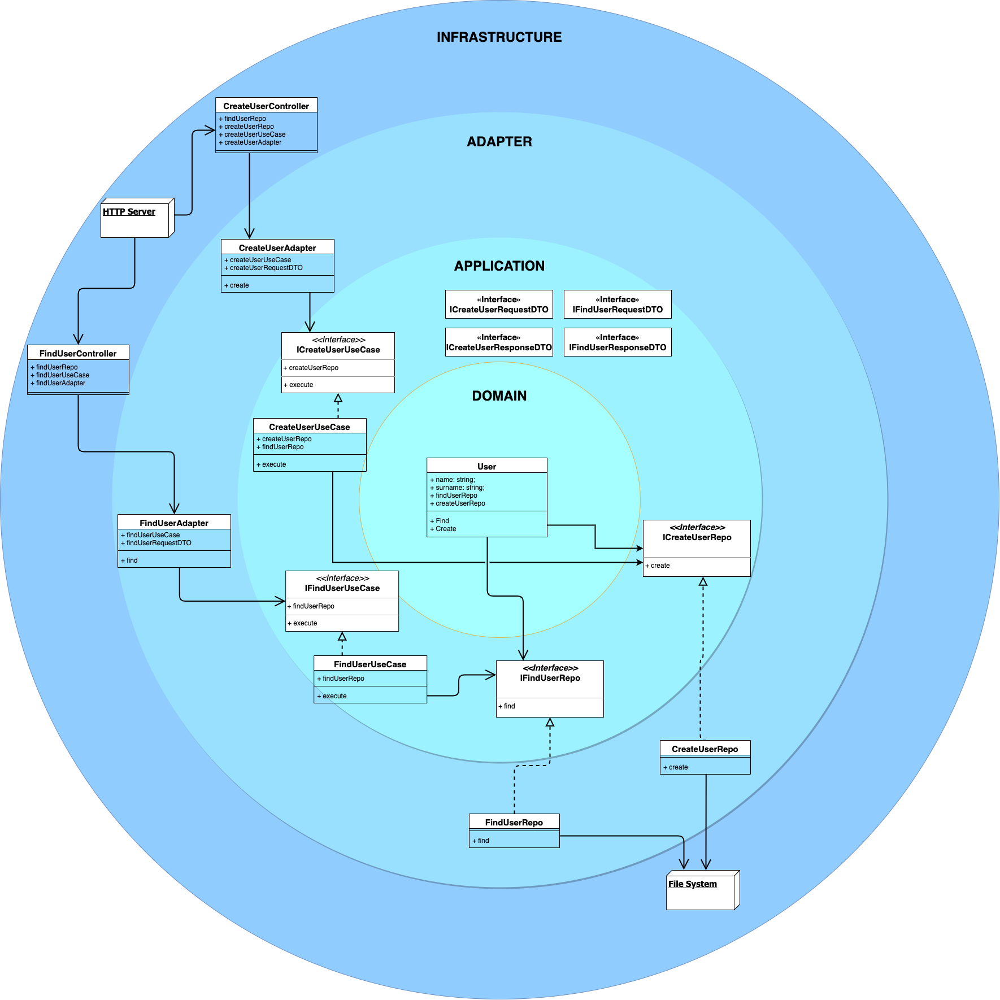

# Test for Clean Architecture API

Minimum reproducible example of a clean architecture written in node/typescript.
Created after «Clean Architecture: A Craftsman's Guide to Software Structure and Design», by Robert C. Martin.

## Install and run

    npm i
    npm run dev

## Docs

Two endpoints:

    `GET /user`
      Accepts parameters `id: number` or `name: string`
    `POST /user`
      Accepts parameters `name: string` or `password: string`

## Diagram

